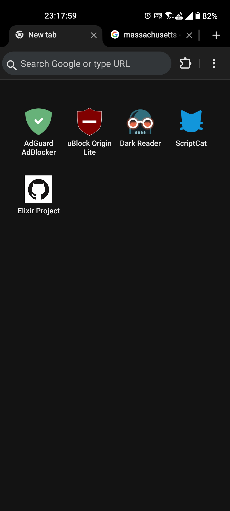
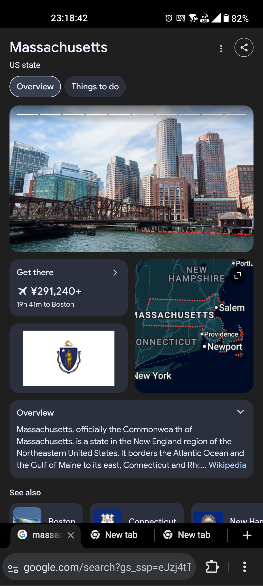
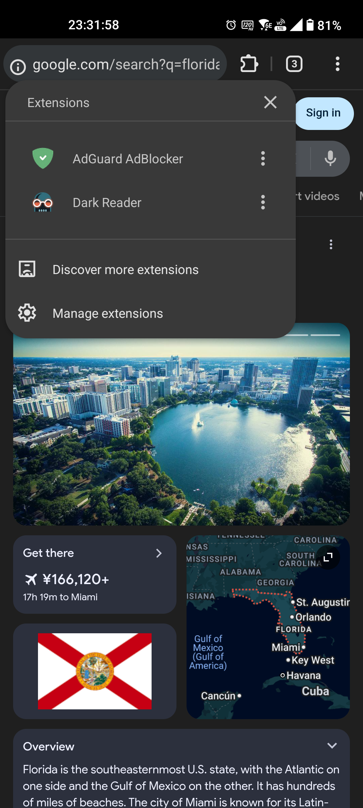

  

  
  

# Elixir Browser

> **[English](README.md) | [日本語 (Japanese)](README.ja.md)**

 

Elixir is a Chromium-based browser with full extension support for Android.  
Inspired by Kiwi Browser, this project focuses on providing extension compatibility, unique UI improvements, and refining inefficient behaviors.  

**Note:** This project has no affiliation with the developers or the team behind Kiwi Browser.  
Elixir is an independent fork built directly from the official Chromium source code. No code or binaries from other browsers (such as Kiwi) have been reused in this project.

Most Google-dependent features have been removed to block unnecessary communications.  
However, high-utility features such as Google Translate and Search Suggestions remain available as optional toggles to ensure user convenience.

 

  
  
  

 

## Key Features

*   **Extension Support**:
    * Install and use the same extensions as desktop Chrome directly from the Chrome Web Store.

*   **Enhanced UI**:
    * **Always-on Tab Bar option**
    * **Bottom Toolbar option**
    * **Removal of unnecessary UI elements**
    * **Google Translate button added to the main menu**
    * **Custom Speed Dial implementation**
    * **Etc...**

*   **Behavioral Improvements**:
    * **Close tab via back gesture**: When there is no remaining back history, the back gesture closes the tab instead of returning to the Home/New Tab Page.
    * **Etc...**

*   **Privacy Protection**:
    * Blocked multiple data transmissions found in original Chromium.

*   **Long-term Development**:
    *   Periodically tracks the latest Chromium releases and provides maintenance on a best-effort basis.

 

## Support & Solemn Oath

Elixir Browser is a project developed solely by an individual.  
**It is completely non-profit. I solemnly swear that this app does not—and will never—include affiliates, personal data collection, or paid content for monetization.**

That said, personal support is always welcome! 🤑  

Modifying and maintaining Chromium is an incredibly grueling task.  
To be honest, it is quite a struggle for a solo developer. To ensure the long-term sustainability of this project, please consider supporting me (the poor dev).  
↓↓↓  
  
<<**[☕ Buy Me A Coffee](https://buymeacoffee.com/sf_flam)**>>  

 

## Download

The latest APK versions are available at the link below:

<<**[Latest Releases](https://github.com/SF-FLAM/ElixirBrowser/releases/latest)**>>

 

## History & Roadmap

Detailed development history and planned future features can be found here.  
Since I originally built this as a personal replacement for Kiwi, the selection of features reflects my own preferences.  
  
**The names of all modified and newly added files are listed in the 'Modified Files' section. Any file not on this list is vanilla Chromium.**  

Most unnecessary Google communications have been removed at the component level.  
This is less about "privacy activism" and more a result of aggressive optimization for a lightweight experience.  
Consequently, some features have been retained because removing them could break core browsing functionality. These are scheduled for removal in future updates, subject to rigorous testing.  
  
<<**[History](./CHANGELOG.md)**>>

 

## Bug Reports

If you encounter any issues, please report them via GitHub Issues. I will do my best to improve the app.  
Note: I primarily use the app with the **Tab Bar enabled and Top Toolbar mode**. Bugs occurring in other UI configurations might have been overlooked.
    
<<**[Issues](https://github.com/SF-FLAM/ElixirBrowser/issues)**>>

 

## Q & A

Q : **What are the system requirements?**  
A : It follows the base Chromium specifications. **Android 10+ (ARM64)** is needed. There is no 32-bit version available.  
 
Q : **Why isn't this open source? Show me the code!**  
A : I aim to make it open source in the future.  
However, all code comments are written in Japanese, so I want to translate them into English before publishing.  
My priority is on updates, and I don't have the bandwidth for code management yet, so I plan to proceed slowly.  
 
Q : **Is there a built-in password manager?**  
A : No. It utilizes the password manager specified in your Android system settings.  
While Google Password Manager is the standard, warnings may appear on non-major browsers like Kiwi or Elixir depending on the Android version. However, password input itself works without issues.  
Personally, I recommend using **Bitwarden** (the standalone app, not the extension). I have confirmed that passkeys work perfectly with it.  
 
Q : **There are two ad-blockers in the Speed Dial defaults; which one is recommended?**  
A : Please use whichever you prefer. Personally, I use **AdGuard**.  

- **uBlock Origin Lite**
  - As of Jan 2026, loading external filters in the custom filter section is technically possible, but it feels like they don't work correctly when loaded.
  - Compared to AdGuard, some ads are not blocked even with the same filters.
  - The extension popup functions perfectly, and manual blocking via element selection is easy.
  - You can easily toggle it OFF temporarily for the current site.

- **AdGuard AdBlocker**
  - Fully supports adding external filters, and gives the impression of no leaks.
  - Blocking via element selection is difficult to use. There is also a strange lag in applying changes.
  - It takes a while to start working after restarting the browser. It feels generally slow.
  - The popup does not function at all (It just spins endlessly on PC too, so maybe it's by design?).
  - It seems impossible to temporarily turn it OFF for the current site.

 

## Bonus

I have included my custom UserScript, **"SMG - Simple Mobile Gestures,"** as a bonus.  
It is designed to be lightweight and reliable while avoiding conflicts with web pages.  
It is intended for users to modify as they see fit; by default, it includes only minimal functionality.  
Please note that for security reasons, the "Close Tab" gesture will not work when there is only one tab open.  

Additionally, as I may implement native gesture functionality into the browser itself in the future, this script may eventually become obsolete.  

<<**[Install UserScript](https://github.com/SF-FLAM/ElixirBrowser/raw/refs/heads/main/userscripts/SMG_SimpleMobileGestures.user.js)**>>
